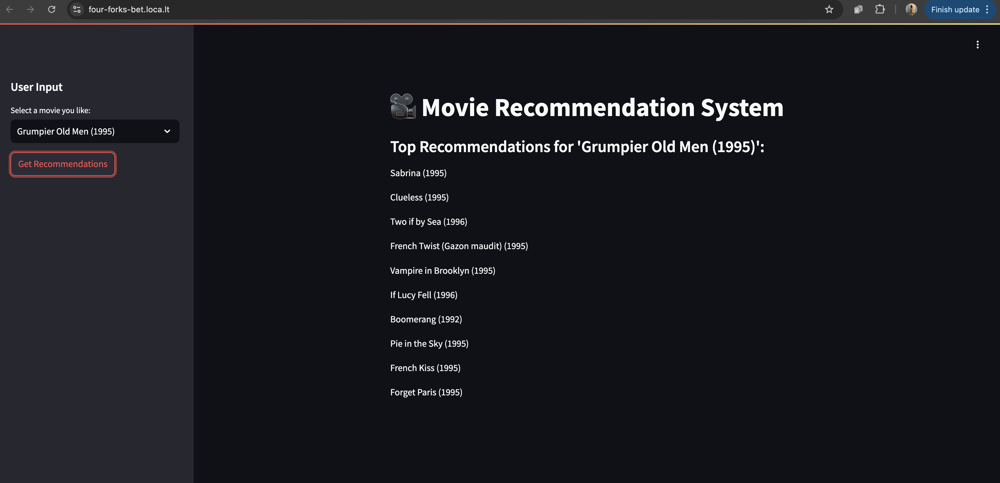

# movie-recommendation-system

Movie Recommendation System Using Neural Collaborative Filtering (NCF)

Welcome to the Movie Recommendation System project! This is designed to recommend movies to users based on their ratings and preferences. The project leverages Neural Collaborative Filtering (NCF) for recommendation generation and integrates Big Data frameworks like PySpark and Dask for efficient data handling and visualization.

Project Description

This project processes the MovieLens 1M dataset, trains a deep learning model using NCF, and generates personalized movie recommendations. By combining machine learning techniques and Big Data frameworks, the system ensures scalability and accuracy in handling large datasets.

Key Features:

	•	Training an NCF Model using PyTorch for collaborative filtering.
	•	Generating top-N movie recommendations based on similarity and predicted ratings.
	•	Incorporating Big Data frameworks (PySpark and Dask) for distributed processing and visualization.
	•	Visualizing user preferences, movie genres, and ratings distribution for insights.

This project draws inspiration from the blog post: Recommendation Systems using Neural Collaborative Filtering (NCF).

Project Structure

.
├── big_data_ml_1m.py               # PySpark pipeline for data preprocessing and recommendation
├── recommendations.csv             # Pre-computed recommendations from the NCF model
├── new_mapped_recommendations.csv  # Movie-to-movie recommendation mapping
├── app1.py                         # Streamlit dashboard for movie recommendations
├── ml-1m/                          # MovieLens 1M dataset folder
└── README.md                       # Project documentation

Installation and Setup

Prerequisites

	•	Python 3.8 or higher.
	•	Required libraries: PyTorch, PySpark, Dask, pandas, numpy, matplotlib, seaborn, and Streamlit.
	•	The MovieLens 1M dataset (ml-1m) should be placed in the project directory.

Steps to Run the Project

	1.	Clone the repository:

git clone <repository-url>
cd <repository-folder>

	2.	Install dependencies:

pip install torch numpy pandas scikit-learn pyspark dask matplotlib streamlit

	3.	Run the Big Data pipeline (PySpark):

spark-submit big_data_ml_1m.py

	4.	Train the Neural Collaborative Filtering (NCF) model:

python big_data_ml_1m.py

	5.	Launch the Streamlit dashboard:

streamlit run app1.py

Explanation of the Mapping Process

The mapping process links each movie to its top-N recommended movies based on similarity or predicted ratings.

Input Data

	•	Movie Metadata (movies.dat):
Contains information about movies (MovieID, Title, Genres).
	•	Recommendation Results (recommendations.csv):
A file containing predicted ratings for all movies, associating each MovieID with a list of highly rated movies.

Mapping Process Steps

	1.	Preprocessing:
	•	Load and clean data.
	•	Explode genres into individual rows for genre-level operations.
	•	Normalize ratings for consistency.
	2.	Similarity Computation:
	•	Genre-Based Similarity:
	•	A cosine similarity matrix is calculated using genres, ranking movies based on genre overlap.
	•	Predicted Ratings-Based Mapping:
	•	Each movie is linked to the movies with the highest predicted ratings.
	3.	Mapping Logic:
	•	Identify Top-N Recommendations:
	•	For each movie, the top-N most similar movies are selected based on genre similarity and predicted ratings.
	•	Exclude Self-Matching:
	•	Movies do not recommend themselves.
	•	Concatenate Recommendations:
	•	Recommendations are stored as a single string, separated by |.
	4.	Output:
	•	A file new_mapped_recommendations.csv contains:
	•	Title: The movie’s name.
	•	RecommendedTitles: Top-N recommended movie titles.

Example:

Title	RecommendedTitles
Toy Story (1995)	Aladdin (1992)
Jumanji (1995)	Jungle Book (1967)

Features

1. NCF Model Training

	•	Encodes UserID and MovieID using LabelEncoder.
	•	Trains an NCF model with user and movie embeddings to predict movie ratings.

2. Recommendations

	•	Generates recommendations for each movie using precomputed ratings and similarity scores.
	•	Outputs a mapped file for easy retrieval.

3. Data Visualization

	•	Insights include:
	•	Top-rated movies by genre.
	•	Distribution of user ratings.
	•	Correlation between user ratings and predicted similarity scores.

4. Streamlit Dashboard

An intuitive web-based interface for exploring recommendations.

Challenges Faced

1. Technological Challenges

	•	Handling Large Data:
	•	Memory constraints were mitigated by using PySpark and Dask.
	•	The mapping of datasets and the process where I got to learn various ways this dataset could be mapped like Cosine Similarity, Matrix Factorization and Content-Based Filtering. What I used in the project is  Neural Collaborative Filtering (NCF) , Genre-Based Cosine Similarity and  Predicted Ratings-Based Mapping. 

2. Changes in Technology

	•	Initially, I trained it on 100k dataset , then shifted it to 1M. My learning was , its not just about the size of dataset but also the formatting of dataset that was done , many attributes were missing in 1 Million dataset . At many places after using other processing techniques like Deep Neural Network (DNN) , I got to know that the the 1M dataset is biased and some movies are given high weights which causes that movie to appear at majority of the places . 

3. Uncovered Aspects from Presentations

	•	Genre-specific insights (e.g., top-rated movies per genre) were explored post-presentation.

Lessons Learned

	•	Combining machine learning with Big Data tools improves scalability.
	•	Preprocessing and effective mapping logic are critical for accurate recommendations.

Future Improvements

	•	Real-Time Recommendations: Add support for dynamic user feedback.
	•	Advanced Models: Implement Transformer-based recommendation models.
	•	Enhanced Dashboard: Introduce more visualizations and interactivity.

Data Sources and Results

	•	Dataset: MovieLens 1M.
	•	Code Repository: GitHub.
	•	Screenshots and Visualizations:
	•	Top-rated movies by genre.
	•	Correlation between ratings and predictions.

Feel free to contribute to this project and share your feedback! 🚀
